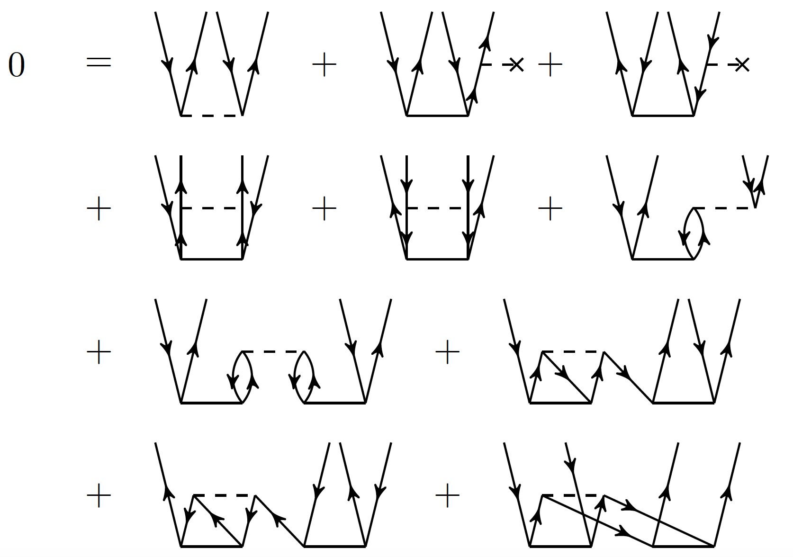

# ```CCpy``` Coupled-cluster package written in Python.

<p style="text-align: right;">Image from: https://nucleartalent.github.io/ManyBody2018/doc/pub/CCM/html/CCM.html</p>

---
# Overview

### Electronic Structure Theory
The goal of modern electronic structure theory is to solve the many-body Schrödinger equation for a system composed of $N$ electrons and $M$ nuclei, defined using atomic units as 

$$H \Psi_\mu(x_1,\ldots,x_N) = E_\mu \Psi_\mu(x_1,\ldots,x_N),$$

where $\Psi_\mu$ is the many-electron wave function for the $\mu^{\rm{th}}$ excited state ($\mu = 0$ refers to the ground state), 

$$H = \sum_{i=1}^N \left[ -\dfrac{1}{2}\nabla^2 - \sum_{A=1}^M \dfrac{Z_A}{r_{iA}} \right] + \sum_{i<j} \dfrac{1}{r_{ij}}$$

is the electronic Hamiltonian, $x_i = (\textbf{r}_i,\sigma_i)$ denotes the combined spatial and spin coordinates for electron $i$, and $E_\mu$ is the electronic energy of state $\mu$. In the definition of the electronic Hamiltonian, we can identify

$$Z = \sum_{i=1}^N z(i),\:\:\mathrm{where}\:\:z(i) = -\dfrac{1}{2}\nabla^2 - \sum_{A=1}^M \dfrac{Z_A}{r_{iA}},$$

as the one-body component consisting of the electron kinetic energy and the electron-nuclear attraction, and 

$$V = \sum_{i<j} v(i,j),\:\:\mathrm{where}\:\:v(i,j) = \dfrac{1}{r_{ij}},$$

as the two-body term describing the electron-electron repulsion. 

The importance of this equation is ubiquitous in physics, chemistry, and materials science. In molecular applications, we are often interested in predicting the potential energy surfaces $E_\mu(\textbf{R})$ that describe how the electronic energies change as a function of nuclear geometry. With accurate potential energy surfaces, one can determine the feasibility and dynamics of chemical reactions (bond breaking and formation) and excited-state photochemical processes. In the solid state, these electronic potential energy surfaces may be recast in the form of band structures which inform on the optical and electronic properties of materials. While molecular (real space) applications are the focus on this project, all of the methods discussed are equally applicable to extended systems using a reciprocal space formulation with periodic boundary conditions.

The Schrödinger equation can be solved analytically for systems with one electron, such as the hydrogen atom or $\rm{He}^+$, but for many-electron systems, a numerical approach is required. The majority of these approaches rely on using a finite-dimensional basis set of molecular spin-orbitals, $\{\phi_p(x)\}_{p=1}^{K}$, obtained from an independent particle-model calculation such as Hartree-Fock to approximate the true many-body wave function $\Psi$. If we recall the Pauli exclusion principle, we know that the many-body wave function $\Psi(x_1,\ldots,x_n)$ must be antisymmetric with respect to the exchange of any two fermionic particle labels $x_i$ and $x_j$. Therefore, we cannot use the spin-orbitals $\phi_p(x)$ to construct $\Psi$ directly, but instead require the use of antisymmetric linear combinations of $\phi_p(x)$ called Slater determinants $\Phi_{p_{i_1}\cdots p_{i_N}} = \sqrt{N!}\mathcal{A}|p_{i_1}\cdots p_{i_N}\rangle$, where $\mathcal{A}$ is an antisymmetrizing projection operator. The Slater determinant $\Phi_{p_{i_1}\cdots p_{i_N}}$ refers to the placement of $N$ electrons into the orbitals $p_{i_1}$ to $p_{i_N}$, along with all such permutations. The exact solution to the Schrödinger equation within the given basis set is found by writing $\Psi$ as a linear combination of all Slater determinants and applying the variational principle to determine the eigenvalue problem that solves for the energy and expansion coefficients. In particular, if 

$$\Psi_\mu = \sum_{I} c_I \Phi_I,$$
then
$$\textbf{H}\textbf{c}_\mu = E_\mu \textbf{c}_\mu,$$

where $H_{KL} = \langle \Phi_K | H | \Phi_L \rangle$ is the Hamiltonian matrix in the basis of Slater determinants and $\textbf{c}_\mu$ are the expansion coefficients for the state $\mu$. Although this procedure, called full configuration interaction (FCI), appears straightforward, it is rarely feasible in practice. This is because a given $K$-dimensional single-particle basis $|\phi_p\rangle$ will afford $\binom{K}{N}$ unique Slater determinants, a number which grows factorially with the size of the problem. As a result, the diagonalization spaces for FCI calculations easily exceed the modern day limits for matrix diagonalization problems. Indeed, for a prototypical chemical molecule such as benzene (which contains 30 correlated electrons), the dimension of the FCI space associated with the smallest reasonable basis set (cc-pVDZ) is on the order of $10^{35}$. As a result, alternative high-level approaches are required to study most problems of chemical interest.

### Coupled-Cluster (CC) Theory
Among the most successful methods used to study the many-body correlation problem are the size-extensive approaches based on the exponential ansatz characterizing the single-reference coupled-cluster (CC) theory. CC theory is based on expressing the true ground state wave function as

$$|\Psi\rangle = e^T |\Phi\rangle,$$

where $|\Phi\rangle$ is a reference Slater determinant (typically the Hartree-Fock wave function), $T = \sum_{n=1}^N T_n$ is the cluster operator with many-body components $T_n$ defined as

$$T_n = \sum_{ \substack{i_1<\cdots<i_n \\ a_1<\cdots<a_n} } t_{a_1\ldots a_n}^{i_1\ldots i_n} E_{i_1\ldots i_n}^{a_1\ldots a_n},$$

and $E_{i_1\ldots i_n}^{a_1\ldots a_n}$ is the elementary particle-hole excitation operator that generates the excited Slater determinant $|\Phi_{i_1\ldots i_n}^{a_1\ldots a_n}\rangle$ out of $|\Phi\rangle$ (we adopt the usual convention in which $i_1,\ldots,i_n$ and $a_1,\ldots,a_n$ indices denote molecular spin-orbitals that are occupied and unoccupied in the reference $|\Phi\rangle$, respectively). CC theory is formally exact (equivalent to FCI) in the limit that all possible cluster operators up to $T_N$, where $N$ is the number of correlated electrons, are included in the wave function ansatz. However, in practice, $T$ is truncated at some low many-body rank to generate a hierarchy of CC approximations.

The simplest and most practical approximation occurs when $T$ is truncated at $T_2$. This generates the CC with singles and doubles (CCSD) approach, which has computational steps that scale as $\mathcal{O}(\mathcal{N}^6)$, where $\mathcal{N}$ is a measure of the system size. While CCSD can often provide qualitatively accurate results for non-degenerate systems near equilibrium geometries, the next level of this hierarchy called the CC with singles, doubles, and triples method (CCSDT), occuring when $T$ is truncated at $T_3$, allows for quantitative accuracy and greater predictive power over wider regions of the molecular potential energy surface. CCSDT, however, has computational steps which scale as $\mathcal{O}(\mathcal{N}^8)$ and thus remains impractical for the vast majority of chemical problems. Higher-order appproximations corresponding to truncating $T$ at $T_4$, resulting in the CC with singles, doubles, triples, and quadruples approach (CCSDTQ), or other methods defined with $n > 4$ are possible, generating a systematically improvable hierarchy of powerful quantum chemical methods that can solve the many-body Schrödinger equation in polynomial (as opposed to factorial) time.

Given a particular truncation of the $T$ operator, the ground-state CC theory proceeds by determining the cluster amplitudes $t_{a_1\ldots a_n}^{i_1\ldots i_n}$ by solving the system of nonlinear energy-independent equations defined by the projections

$$\langle \Phi_K | \overline{H} | \Phi \rangle = 0,$$

where $\overline{H} = e^{-T} H e^T$ is the similarity-transformed Hamiltonian corresponding to the chosen level of truncation characterizing $T$. Once the above equations are solved, the CC energy can be found by taking the expectation value of $\overline{H}$ in the reference determinant

$$E_{CC} = \langle \Phi | \overline{H} | \Phi \rangle.$$

We also note that the ground-state CC theory described above can be extended to the calculation of excited states using, for example, the equation-of-motion (EOM) extension of the CC theory, producing the EOMCC hierarchy defined by applying a linear excitation operator 

$$R_\mu = r_{0,\mu} + \sum_{n=1}^N R_{\mu,n},\:\:\mathrm{where}\:\: R_{\mu,n} = \sum_{ \substack{i_1<\cdots<i_n \\ a_1<\cdots<a_n} } r_{\mu,a_1\ldots a_n}^{i_1\ldots i_n} E_{i_1\ldots i_n}^{a_1\ldots a_n},$$

to the ground-state CC ansatz to generate the EOMCC wave function for the $\mu^{\mathrm{th}}$ excited state

$$|\Psi_\mu\rangle = R_\mu e^T |\Phi\rangle.$$

By truncating $R_\mu$ and $T$ at equivalent many-body ranks, one can generate the EOMCC hierarchy of approximations, including EOMCCSD, EOMCCSDT, EOMCCSDTQ, and so on. The $R_{\mu,n}$ operator is found by simply diagonalizing the similarity-transformed Hamiltonian in the appropriate subspace of the many-electron Hilbert space (e.g., the space of all singles and doubles for EOMCCSD or the space of all singles, doubles, and triples for EOMCCSDT, and so on),

$$\langle \Phi_K | \overline{H} R_\mu | \Phi \rangle = E_\mu r_{\mu,K},$$

to obtain the amplitudes linear excitation amplitudes $r_{\mu,K}$ as the eigenvectors and excited state energies $E_\mu$ as the eigenvalues.

It is well-established that in the majority of chemical and molecular applications, including molecules near equilibrium geometries, bond dissociations involving smaller numbers of strongly correlated electrons, noncovalent interactions, and photochemistry, the higher-ranking members of the CC theory, such as CCSDT and CCSDTQ, along with their excited state EOM extensions of EOMCCSDT and EOMCCSDTQ, are often powerful enough to converge the highly accurate properties and energetics needed for chemically quantitative and predictive work. However, they are plagued in practice by steep $\mathcal{O}(\mathcal{N}^8)$ and $\mathcal{O}(\mathcal{N}^{10})$ numerical costs, respectively. Therefore, a main activity in the CC development work has been the design of computationally feasible approaches that maintain fidelity to the highly accurate CCSDT or CCSDTQ energetics, but at a fraction of their computational costs. Typically, researchers have made use of the popular perturbative CCSD(T)-type noniterative corrections, however, these methods are hindered by divergences and instabilities in the underlying perturbation series. In our research group, we have followed a different approach and relied on the non-perturbative corrections generated from the biorthogonal moment expansions characterizing the completely-renormalized (CR) CC methods, including the CR-CC(2,3) correction to CCSD, and its generalization in the CC($P$;$Q$) formation in which the results of a general CC($P$) calculation performed in the subspace $\mathcal{H}^{(P)}$ of the many-electron Hilbert space are corrected for missing correlation effects contained in an orthogonal subspace called $\mathcal{H}^{(Q)}$. The selection of determinants that span $\mathcal{H}^{(P)}$ can be determined using active orbitals, as in the CC(t;3) approach, or they can be automatically generated using the information derived from external wave functions of the configuration interaction (CI) quantum Monte Carlo (QMC) or selected CI type. In this project, a self-contained way to select the $\mathcal{H}^{(P)}$ subspace is pursued using the adaptive CC($P$;$Q$) scheme. In adaptive CC($P$;$Q$), important determinants are identified on the basis of their contribution to the non-iterative CC($P$;$Q$) moment correction. The advantage of adaptive CC($P$;$Q$) is of course that one can run a black-box CC($P$;$Q$) calculation in an entirely self-contained and self-propelling manner. As an additional benefit, the codes developed in this package for adaptive CC($P$;$Q$) can be easily adapted to calculations of the CIQMC- or selected-CI-driven CC($P$;$Q$) types.

---
# Program Description

In this project, I will be working on developing and transforming ```CCpy``` into a reasonably performant and easy-to-use Python package for CC($P$;$Q$) calculations for ground and excited electronic states of molecular systems. CC calculations are, by any measure, quite computationally demanding, and they are typically written using fast computer languages such as Fortran or C++. A major advantage to using Python is that the code becomes simpler to develop, maintain, and, in general, it could be more appealing to a wider audience of researchers who may be more familiar with using Python than Fortran. In addition, CC calculations make heavy use of multidimensional tensor contractions, and thus the ```np.einsum``` function is an exceptionally useful tool for writing performant yet transparent and easy-to-debug code. Because Python can be linked to fast linear algebra libraries such as Intel MKL, these contractions using ```np.einsum``` run at the about the same speed as low-level ```dgemm``` routines that would be used in Fortran. However, the main speed drawback of Python lies in its handling of nested loops, and unfortunately, CC calculations feature many deep loops. While there exist just-in-time (JIT) compiling tools within the Python language (e.g., Numba) that will speed up Python code in this respect, I have instead chosen to remedy this problem by integrating Fortran90 code into ```CCpy``` using ```f2py``` so that the most expensive parts of the calculations (typically those featuring deep loops) can be run much faster. This choice was mainly motivated by the fact that Numba can be somewhat tricky to get working when the code is not written in pure Python (e.g., there is limited Numpy and Scipy support), and in some instances, there are tensor contractions within the body of the loop, so being able to write regular Fortran90 code with access to Intel MKL BLAS libraries is more convenient.

I started writing this code from scratch in February 2021 and thus, there already exist a number of working subroutines that have been tested in research production. Currently, the available calculations in ```CCpy``` are
 
    CCSD / left-CCSD
    CCSDT
    CR-CC(2,3)
    EOMCCSD / left-EOMCCSD
    EOMCCSDT
    CR-EOMCC(2,3)
    Adaptive CC(P;Q)
    
As the main deliverables of my project, I would like to include 3 main additions to the existing codebase:

1. Development of a smart initial guess for the EOMCC calculations. Currently, the trivial configuration interaction singles (CIS) guess is being used to locate the structure of excited state roots that are converged to their true EOMCC value using the iterative non-Hermitian Davidson eigensolver. I would like to add the more useful EOMCCSd initial guess that uses a subset of doubly excited configurations defined using active orbitals. I would also like to spin and symmetry adapt this initial guess vector so that I may converge states of any specified spin multiplicity and symmetry without running into convergence or root-flipping issues that would plague a usual solver.


2. Implementation of the left-CCSDT and left-EOMCCSDT theories. In general, the left-CC routines are used to obtain the dual space wave functions (the bra state) associated with a CC ket state. In CC theory, the bra and ket states are distinct due the non-Hermitian nature of the similarity-transformed Hamiltonian $\overline{H}$. These are important quantities as they are needed to evaluate physical properties (expectation values), and of particular importance here, they are used to calculate the CR-CC and CC($P$;$Q$) energy corrections. Currently, I am using the left-CC vectors arising from the left-CCSD / left-EOMCCSD calculations to compute these quantities (known as the two-body approximation), and while it is a successful approach, the most desirable energy correction would be one that uses the more complete left-CCSDT / left-EOMCCSDT vectors.


3. Once the left-CCSDT and left-EOMCCSDT equations are derived, implemented, and properly tested, I would like to incorporate them into the full CR-CC and CC($P$;$Q$) corrections for ground and excited states.


The overarching goal of this project is to transform ```CCpy``` into a professional package, which entails adding function and module docstrings, in addition to developing the proper software structures for robust testing, package management, and installation so that ```CCpy``` can be used by researchers in other groups as well.

---
# Project Goals and Timeline

- 9/17/2021 (Fri) - Proposal (this document) due.


- 9/24/2021 (Fri) - Create project git repository. Add docstrings to all functions and modules. Begin using the git repository to continually push and update the code.


- 10/1/2021 (Fri) - Implement spin and symmetry-adapted EOMCCSd initial guess.


- 10/15/2021 (Fri) - Implement left-CCSDT solver.


- 10/22/2021 (Fri) - Implement the full CC($P$;$Q$) correction into the Adaptive CC($P$;$Q$) ground and excited state routines.


- 10/29/2021 (Fri) - Begin writing unit tests for every subroutine and create a separate structure to the package so that source code is in one directory, testing code is in another, and build/compilation code is in another.


- 11/12/2021 (Fri) - Finalize the testing and ensure that the code is properly set up so that it can be downloaded and installed properly on any computer. Generate the code documentation using Sphinx.


- 11/24/2021 (Wed) - By this point, I would like to have the package set up so that it can be used via Jupyter notebook. This feature should be thoroughly tested.


- 12/2/2021 (Wed) - Final project and demonstration due.

---
# Anticipating Challenges  

1. There will always be analytical challenges in deriving the left-CCSDT equations. There are also similar challenges with implementing the EOMCCSd initial guess.

2. I will have to learn how to manage the Python files and packages so that they can be installed properly and not throw any dependency errors. I have never paid attention to this in the code thus far and there may be lurking bugs.

3. I will have to make sure that the integration of Fortran90 code into Python using ```f2py``` is robust such that the compilation options (e.g. Makefile) can be configured to run on any machine.

4. Currently, ```CCpy``` is meant to be used on high-performance computer clusters, so the interface for running it is a bit different than for usual Python packages. Instead of writing modules that are meant to be imported into a Jupyter notebook for scripting, ```CCpy``` runs off of an input file that specifies all of the calculation parameters. It then parses that information and performs the requested calculation(s), logging the data into an output file. The switch from this style to a more scripting-friendly format may be quite challenging, and in the end, I will still want to keep the current format because that is the most useful for my research.


Affiliated with Piecuch Group at MSU (https://www2.chemistry.msu.edu/faculty/piecuch/)
