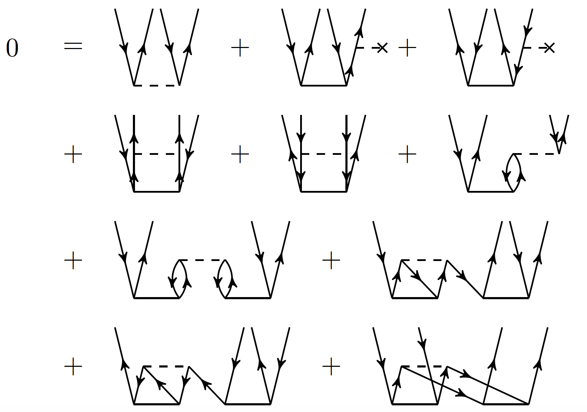

# CCpy: A coupled-cluster package written in Python.

Image from: https://nucleartalent.github.io/ManyBody2018/doc/pub/CCM/html/CCM.html

---

Welcome to ccpy's documentation. Get started with the
[Installation](installation) section and
then proceed with the [Quickstart](quickstart) to get an idea of how this project works. You
can get a more detailed [Tutorial](tutorial) that explores

# User's Guide
For a more thorough introduction into ccpy, please follow the contents below.

- [Foreword](foreword)
- [Installation](installation)
- [Quickstart](quickstart)
